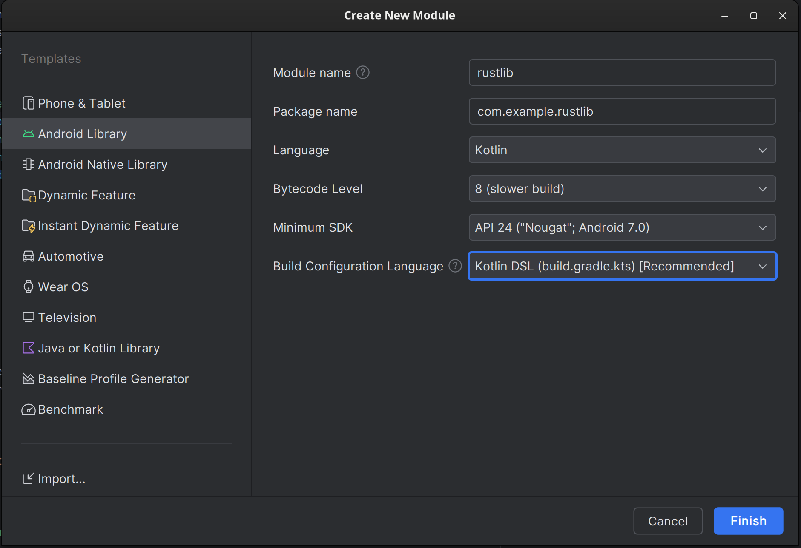
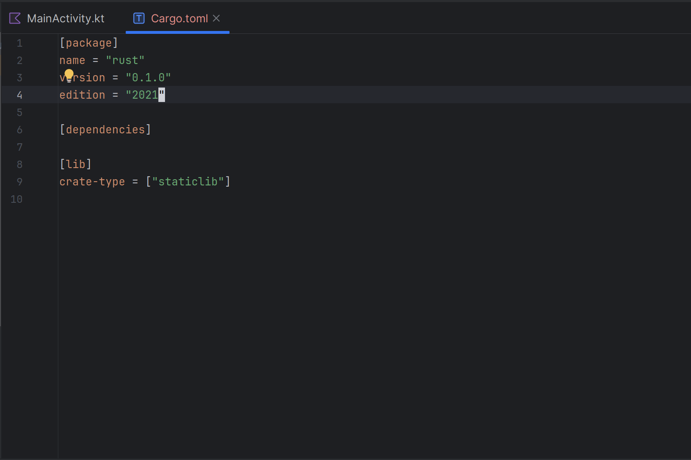
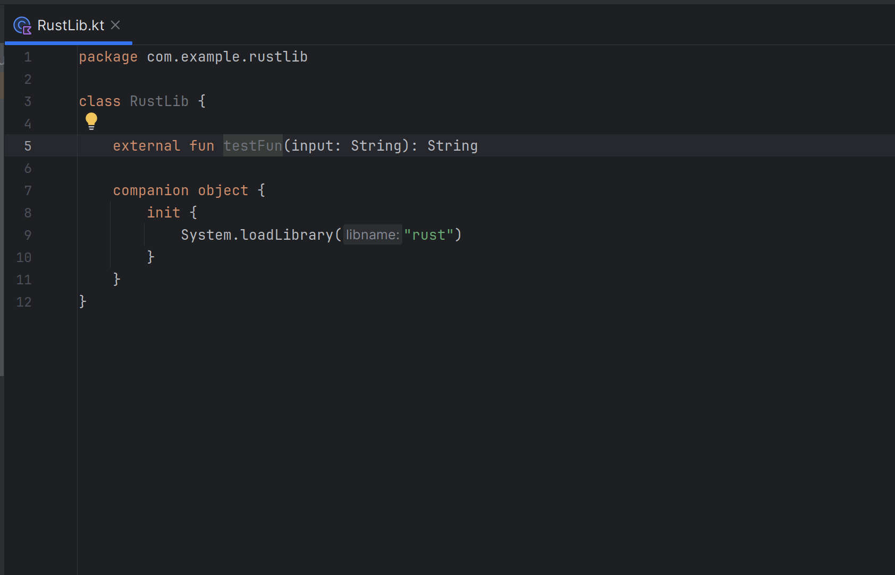
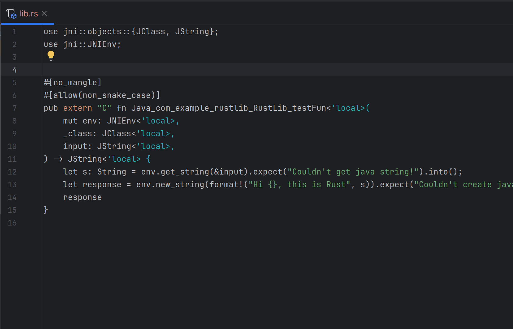

+++
title = 'Rust in Android App'
date = 2024-08-31T09:33:41-07:00
draft = false
+++

# Rust in android app ? How ?

This article walk you through how to embed rust module into an android app in kotlin and kotlin DSL

Mozilla's [rust-android-gradle](https://github.com/mozilla/rust-android-gradle) is a great start, a great tool that we'll be using to integrate rust in to our android app.

In the beninging ...

### Step 1

In your android app, create a new library module, we'll name ours rustlib



Note the build configuration language set to kotlin DSL


### Step 2
Of course don't forget to import your module, in app or whichever module you're planning to use it on.

In your module's build.gradle.kts file add dependency;

    `implementation(project(":rustlib"))`

### Step 3
Install the rust toolchains for your target platforms:

```
rustup target add armv7-linux-androideabi   # for arm
rustup target add i686-linux-android        # for x86
rustup target add aarch64-linux-android     # for arm64
rustup target add x86_64-linux-android      # for x86_64
rustup target add x86_64-unknown-linux-gnu  # for linux-x86-64
rustup target add x86_64-apple-darwin       # for darwin x86_64 (if you have an Intel MacOS)
rustup target add aarch64-apple-darwin      # for darwin arm64 (if you have a M1 MacOS)
rustup target add x86_64-pc-windows-gnu     # for win32-x86-64-gnu
rustup target add x86_64-pc-windows-msvc    # for win32-x86-64-msvc
...
```

### Step 4
Create your rust library.

Inside the folder `/yourprojectfolder/rustlib/src/main/`, create your rust library here.

    `cargo new --lib rust`

I call it rust but call it whatever you wish just don't do lib{whatever} because you'll have to do liblib{whatever} later on, and it'll be very confusing, and you'll have a long day like I did.

Edit your `cargo.toml` file as shown below, to tell rust that you want a statically linked library .so in short and not .rlib



### Step 4

Add rust android gradle plugin to your project. 

`lib.versions.toml` file add: 

`rust-android-gradle = { id =  "org.mozilla.rust-android-gradle.rust-android", version.ref = "0.9.4" }`

Edit you rustlib's `build.gradle.kts`  add:
- Rust android gradle plugin

```Kotlin
plugins {
    alias(libs.plugins.rust.android.gradle)
}
```
- Rust library build configuration

```Kotlin
extensions.configure(CargoExtension::class) {
    // Relative path to your rust library if you named/placed it differently
    module = "src/main/rust" 
    // Library name as in cargo.toml
    libname = "rust"
    // x86_64 is for emulator on pc add arm if you plan to compile to physical device
    targets = listOf("x86_64")
    profile = "release"
}

// This script builds and links the rust library every time you build 
// That way you don't have to do the weird ./gradlew cargoBuild that's very tedious

project.afterEvaluate {
    tasks.withType(CargoBuildTask::class)
        .forEach { buildTask ->
            tasks.withType(com.android.build.gradle.tasks.MergeSourceSetFolders::class)
                .configureEach {
                    this.inputs.dir(
                        layout.buildDirectory.dir("rustJniLibs" + File.separatorChar + buildTask.toolchain!!.folder)
                    )
                    this.dependsOn(buildTask)
                }
        }
}
  
```

Great this is it for preconfig now lets move on to the code itself

### Step 6
#### The code

Let's start with the kotlin side of things shall we: 

Create a kotlin class file inside rustlib module, I'll call mine `RustLib.kt`

Inside `RustLib` class file add a constructor to load the static library

```Kotlin
 companion object {
        init {
            // Library name here the same as one specified in cargo.toml file
            System.loadLibrary("rust")
        }
    }
```

Add test function `external fun inputFun(input: String): String`



#### Rust side
In your rust library add the jni library `cargo add jni`

I'll be honest from this point you're better off reading the [jni documentation](https://docs.rs/jni/latest/jni/) 
before implementing the rest of it. So go on then, then come back when jni make sense.

Then create your rust test function 



well done that's your hello world in rs jni whatever, pay attention to the rust function naming here, it's a puzzle,
but I trust you'll figure it out 

Now link RustLib class to your UI or test and run

If you did everything right your project should compile 


